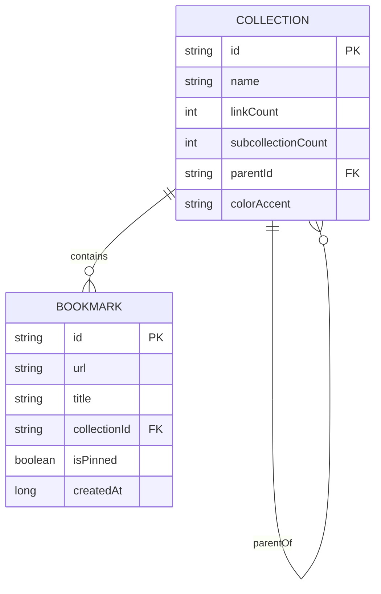

# Data Model: Collection Bookmarks List

## Entities & Schemas

### 1. Collection Entity (`CollectionEntity`)

Represents a folder or category containing saved bookmarks and optional nested subcollections.

| Field | Type | Constraint | Description |
|-------|------|------------|-------------|
| `id` | String | Primary Key | Unique collection identifier (e.g. `col_vagas`) |
| `name` | String | NOT NULL | Display title of the collection (e.g. "Vagas") |
| `linkCount` | Int | Default 0 | Total number of bookmarks stored in this collection |
| `subcollectionCount` | Int | Default 0 | Total number of subcollections nested under this collection |
| `parentId` | String? | Optional | Parent collection ID for hierarchical nesting |
| `iconKey` | String | NOT NULL | Key mapping to icon representation (e.g. "work", "code") |
| `colorAccent` | String | NOT NULL | Color token name (e.g. "PURPLE", "YELLOW") |
| `createdAt` | Long | Epoch MS | Creation timestamp |
| `updatedAt` | Long | Epoch MS | Last update timestamp |

### 2. Bookmark Entity (`BookmarkEntity`)

Represents a saved web link belonging to a specific collection.

| Field | Type | Constraint | Description |
|-------|------|------------|-------------|
| `id` | String | Primary Key | Unique bookmark UUID |
| `url` | String | NOT NULL | Target web URL |
| `title` | String? | Optional | Fetched web title or custom bookmark title |
| `faviconUrl` | String? | Optional | Favicon or logo image URL |
| `thumbnailUrl` | String? | Optional | Preview thumbnail URL (og:image) |
| `sourcePlatform` | String? | Optional | Identified platform badge (e.g. "LinkedIn", "GitHub") |
| `collectionId` | String | Foreign Key | ID of destination collection |
| `isPinned` | Boolean | Default false | Pin state for priority sorting |
| `createdAt` | Long | Epoch MS | Creation timestamp |
| `syncStatus` | String | Default "PENDING_SYNC" | Sync state enum |

## Entity Relationships



## State Transitions & UI States

### Collection Detail UI State (`CollectionDetailUiState`)

```kotlin
data class CollectionDetailUiState(
    val isLoading: Boolean = true,
    val collection: CollectionEntity? = null,
    val bookmarks: List<BookmarkEntity> = emptyList(),
    val subcollections: List<CollectionEntity> = emptyList(),
    val error: String? = null
)
```
