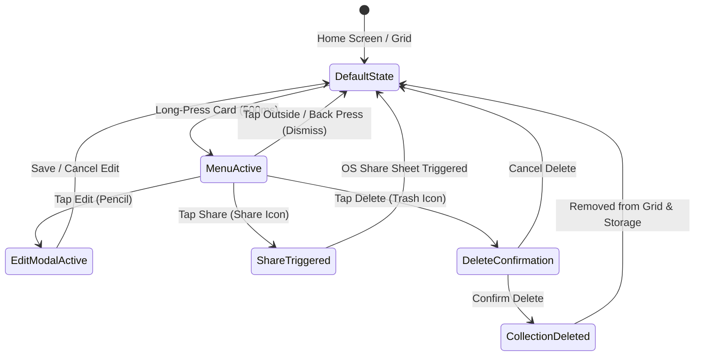

# Data Model: Collection Long-Press Actions Menu

## Entities & Schemas

### 1. Collection Entity (`CollectionEntity`)

Represents a collection folder stored in Room database.

| Field | Type | Constraint | Description |
|-------|------|------------|-------------|
| `id` | String | Primary Key | Unique collection UUID (e.g. `col_ia`, `col_vagas`) |
| `name` | String | NOT NULL | Collection name (e.g. "IA") |
| `linkCount` | Int | Default 0 | Count of bookmarks inside this collection |
| `colorAccent` | String | NOT NULL | Color token name (`YELLOW`, `PURPLE`, `ORANGE`, `BLUE`) |
| `iconKey` | String | NOT NULL | Icon key (`code`, `work`, `folder`, `star`, etc.) |
| `createdAt` | Long | Epoch MS | Creation timestamp |
| `updatedAt` | Long | Epoch MS | Modification timestamp |

---

### 2. Collection Action Event & State (`CollectionActionsState`)

Represents transient UI states managing long-press context menu and active action modals.

```kotlin
data class CollectionActionsState(
    val activeMenuCollection: CollectionEntity? = null,
    val collectionToEdit: CollectionEntity? = null,
    val collectionToDelete: CollectionEntity? = null,
    val isSharing: Boolean = false
)
```

| State Field | Type | Nullable | Description |
|-------------|------|----------|-------------|
| `activeMenuCollection` | `CollectionEntity?` | Nullable | Collection currently highlighted by long-press menu overlay |
| `collectionToEdit` | `CollectionEntity?` | Nullable | Collection currently open in the Edit dialog |
| `collectionToDelete` | `CollectionEntity?` | Nullable | Collection pending deletion in confirmation dialog |
| `isSharing` | `Boolean` | Non-Null | Indicates active native OS share trigger |

---

## State Transition Diagram



## UI State Contracts

### Extended `HomeScreenUiState.Success`

```kotlin
data class Success(
    val collections: List<CollectionEntity>,
    val quickSaveUrlInput: String = "",
    val inputError: String? = null,
    val isSaving: Boolean = false,
    val activeMenuCollection: CollectionEntity? = null,
    val collectionToEdit: CollectionEntity? = null,
    val collectionToDelete: CollectionEntity? = null
) : HomeScreenUiState
```
