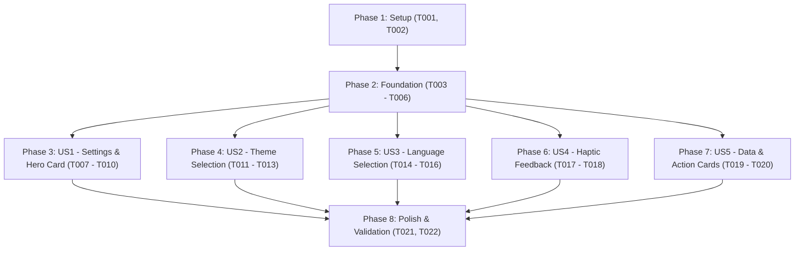

# Tasks: Settings Screen, Theme & Language Preferences, and Usage Overview

**Input**: Design documents from `/specs/005-settings-screen/`
**Prerequisites**: `plan.md`, `spec.md`, `research.md`, `data-model.md`, `contracts/settings-ui-contract.md`

## Format: `[ID] [P?] [Story] Description`
- **[P]**: Can run in parallel (different files, no dependencies)
- **[Story]**: User story identifier ([US1], [US2], [US3], [US4], [US5])

---

## Phase 1: Setup (Shared Infrastructure)

**Purpose**: Localization strings and base models initialization

- [x] T001 Create localization string resources for English in `android/app/src/main/res/values/strings.xml` and Brazilian Portuguese in `android/app/src/main/res/values-pt-rBR/strings.xml`
- [x] T002 [P] Define `UserSettings` enums (`AppThemeMode`, `AppLanguage`) and data models in `android/app/src/main/java/com/madruga665/bookmarks/data/repository/SettingsRepository.kt`

---

## Phase 2: Foundational (Blocking Prerequisites)

**Purpose**: Core DataStore preferences repository and shared state models

**⚠️ CRITICAL**: Must complete before user story UI implementation

- [x] T003 Implement `SettingsRepository` backed by Jetpack DataStore Preferences (`app_theme_mode`, `app_language`, `haptic_feedback_enabled`) in `android/app/src/main/java/com/madruga665/bookmarks/data/repository/SettingsRepository.kt`
- [x] T004 [P] Register `SettingsRepository` provider in Hilt DI module `android/app/src/main/java/com/madruga665/bookmarks/di/AppModule.kt`
- [x] T005 [P] Create `SettingsUiState`, `UsageStatistics`, and `SettingsEvent` in `android/app/src/main/java/com/madruga665/bookmarks/ui/settings/SettingsUiState.kt`
- [x] T006 Unit test `SettingsRepository` and `SettingsViewModel` state emission in `android/app/src/test/java/com/madruga665/bookmarks/ui/settings/SettingsViewModelTest.kt`

**Checkpoint**: Foundation ready — User Story implementation can proceed.

---

## Phase 3: User Story 1 - Settings Screen & Top Yellow Usage Hero Card (Priority: P1) 🎯 MVP

**Goal**: Display the Settings screen with top app bar, back navigation, and top yellow Neobrutalist Hero Card showing real-time metrics for total links, links added today, and total collections.

**Independent Test**: Open Settings from Home, verify top bar renders with `<` back button, and yellow hero card displays live stats for "Links today", "Total links", and "Collections".

- [x] T007 [P] [US1] Create `UsageHeroCard` composable with `#FFE600` background, 2.5dp black border, drop shadow, app badge, "FREE PLAN" badge, dual metric boxes, and action button in `android/app/src/main/java/com/madruga665/bookmarks/ui/settings/components/UsageHeroCard.kt`
- [x] T008 [US1] Implement `SettingsViewModel` combining `BookmarkRepository` and `CollectionRepository` flows to compute `totalBookmarks`, `bookmarksToday` (local midnight boundary), and `totalCollections` in `android/app/src/main/java/com/madruga665/bookmarks/ui/settings/SettingsViewModel.kt`
- [x] T009 [US1] Create `SettingsScreen` composable with top app bar, back button, and `UsageHeroCard` in `android/app/src/main/java/com/madruga665/bookmarks/ui/settings/SettingsScreen.kt`
- [x] T010 [US1] Connect `NavRoutes.SETTINGS` in `android/app/src/main/java/com/madruga665/bookmarks/ui/navigation/NavGraph.kt` to bind `SettingsViewModel` and render `SettingsScreen`

**Checkpoint**: User Story 1 complete and independently testable as MVP.

---

## Phase 4: User Story 2 - Theme Preference Selection (Priority: P1) 🎯 MVP

**Goal**: Allow users to select Light, Catppuccin Mocha Dark, or System Default theme with instant UI propagation across the entire app and DataStore persistence.

**Independent Test**: Change theme in Settings to Dark, verify immediate color palette update across all screens without app reload, and verify persistence after app restart.

- [x] T011 [P] [US2] Create `PreferenceItemCard` and `ThemeSelectionDialog` composables with Neobrutalist styling in `android/app/src/main/java/com/madruga665/bookmarks/ui/settings/components/PreferenceItemCard.kt` and `android/app/src/main/java/com/madruga665/bookmarks/ui/settings/components/ThemeSelectionDialog.kt`
- [x] T012 [US2] Wire theme selection event in `SettingsViewModel.kt` and integrate `ThemeSelectionDialog` into `SettingsScreen.kt`
- [x] T013 [US2] Update `MainActivity.kt` to observe `SettingsRepository.themeMode` StateFlow and dynamically supply `darkTheme` boolean to `NeobrutalismTheme`

**Checkpoint**: User Story 2 complete and independently testable.

---

## Phase 5: User Story 3 - Language Selection (English & Brazilian Portuguese) (Priority: P1) 🎯 MVP

**Goal**: Allow users to toggle between English and Brazilian Portuguese with immediate locale update for UI strings.

**Independent Test**: Select "Português (Brasil)" in Settings, verify interface strings change to Portuguese across all screens, and confirm English strings restore when switching back.

- [x] T014 [P] [US3] Create `LanguageSelectionDialog` composable in `android/app/src/main/java/com/madruga665/bookmarks/ui/settings/components/LanguageSelectionDialog.kt`
- [x] T015 [US3] Implement `setLanguage` in `SettingsRepository` and `SettingsViewModel` to persist language choice and apply locale via `AppCompatDelegate.setApplicationLocales`
- [x] T016 [US3] Integrate language preference item and `LanguageSelectionDialog` into `SettingsScreen.kt`

**Checkpoint**: User Story 3 complete and independently testable.

---

## Phase 6: User Story 4 - Haptic Feedback & Interaction Preferences (Priority: P2)

**Goal**: Provide a toggle switch for Haptic Feedback in Settings to enable/disable tactile vibration on button clicks.

**Independent Test**: Toggle the Haptic Feedback switch in Settings, verify state persistence, and confirm vibration behavior.

- [x] T017 [P] [US4] Create `HapticFeedbackHelper` utility in `android/app/src/main/java/com/madruga665/bookmarks/ui/utils/HapticFeedbackHelper.kt`
- [x] T018 [US4] Add `HapticFeedbackPreferenceCard` with toggle switch to `SettingsScreen.kt` and connect to `SettingsViewModel.toggleHapticFeedback()`

---

## Phase 7: User Story 5 - Data Management & Information Cards (Priority: P3)

**Goal**: Render "YOUR DATA" (Export Backup, Restore Backup), "IMPORT FROM OTHER APPS" (Import Bookmarks), and "ABOUT" sections with Neobrutalist action cards.

**Independent Test**: Scroll down Settings screen and verify all action cards render with appropriate icons, titles, subtitles, and chevron indicators.

- [x] T019 [P] [US5] Create `ActionItemCard` composable with icon, title, description, and chevron in `android/app/src/main/java/com/madruga665/bookmarks/ui/settings/components/ActionItemCard.kt`
- [x] T020 [US5] Integrate "YOUR DATA", "IMPORT FROM OTHER APPS", and "ABOUT" sections into `SettingsScreen.kt`

---

## Phase 8: Polish & Cross-Cutting Validation

**Purpose**: End-to-end test execution and quality checks

- [x] T021 [P] Create UI unit test for `SettingsScreen` and `UsageHeroCard` in `android/app/src/test/java/com/madruga665/bookmarks/ui/settings/SettingsScreenTest.kt`
- [x] T022 Execute all project unit tests (`cd android && ./gradlew test`) and fix any regressions

---

## Dependencies & Execution Order

---

## Implementation Strategy (Subagents & Parallel Opportunities)

- **Subagent Delegation**: In accordance with project governance, execution of tasks during `/speckit-implement` MUST be delegated to subagents via `invoke_subagent`.
- **Parallel Dispatch `[P]` Opportunities**:
  - `T001` & `T002` can be implemented concurrently.
  - `T004` & `T005` can be implemented concurrently after `T003`.
  - Independent UI components (`T007`, `T011`, `T014`, `T017`, `T019`) can be created in parallel batches.
- **MVP Scope**: Phases 1, 2, and 3 (US1) provide a functional Settings screen with live usage stats. Phases 4 and 5 complete the P1 theme and language features.
