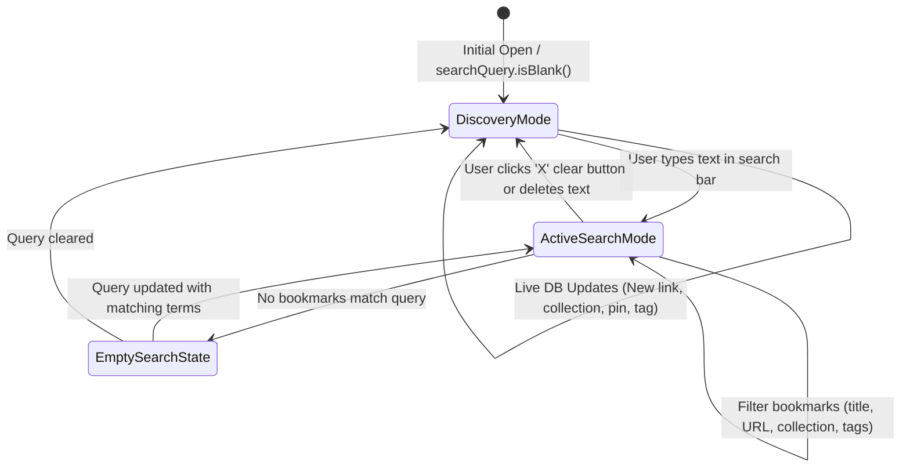

# Data Model & Presentation State: Search Screen with Library Statistics & Discovery

**Feature Branch**: `008-search-screen-discovery`
**Spec Reference**: [spec.md](./spec.md)

## 1. Domain Entities & Value Objects

### `LibraryStats` (Value Object)
Represents the aggregated statistics of the user's bookmarks library.

```kotlin
data class LibraryStats(
    val collectionsCount: Int = 0,
    val linksCount: Int = 0,
    val pinnedCount: Int = 0,
    val tagsCount: Int = 0
)
```

**Invariants & Rules**:
- `collectionsCount >= 0`: Count of all active collections.
- `linksCount >= 0`: Count of all saved bookmarks.
- `pinnedCount >= 0`: Count of bookmarks where `isPinned == true`.
- `tagsCount >= 0`: Count of distinct non-empty tags across all bookmarks.

---

## 2. Presentation Layer State

### `SearchUiState` (State Holder)
Immutable state consumed by `SearchScreen` Composable.

```kotlin
data class SearchUiState(
    val isLoading: Boolean = false,
    val searchQuery: String = "",
    val libraryStats: LibraryStats = LibraryStats(),
    val recentlySavedBookmarks: List<BookmarkEntity> = emptyList(),
    val searchResults: List<BookmarkEntity> = emptyList(),
    val collectionsMap: Map<String, CollectionEntity> = emptyMap(),
    val userMessage: String? = null
) {
    val isSearching: Boolean
        get() = searchQuery.isNotBlank()

    val hasSearchResults: Boolean
        get() = isSearching && searchResults.isNotEmpty()

    val isEmptySearchResult: Boolean
        get() = isSearching && searchResults.isEmpty() && !isLoading
}
```

### State Transitions & Flow



---

## 3. Search Matching Logic

When filtering `BookmarkRepository.allBookmarks` with `query: String`:
1. Normalize query: `val cleanQuery = query.trim().lowercase()`
2. For each bookmark:
   - Match `title.lowercase().contains(cleanQuery)`
   - OR Match `url.lowercase().contains(cleanQuery)`
   - OR Match `tags.lowercase().split(",").any { it.trim().contains(cleanQuery) }`
   - OR Match collection name from `collectionsMap[bookmark.collectionId]?.name?.lowercase()?.contains(cleanQuery) == true`
3. Return sorted results (pinned items first, then by `updatedAt` / `createdAt` descending).

