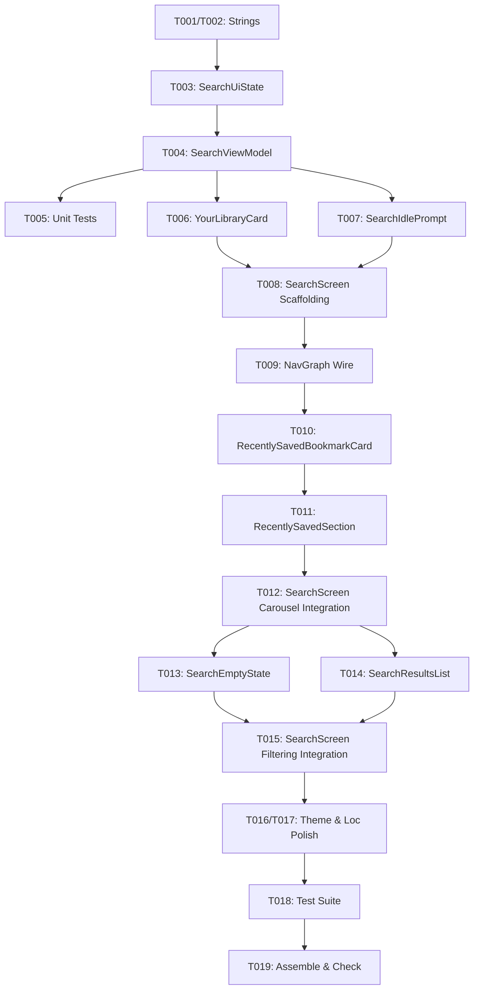

# Tasks: Search Screen with Library Statistics & Discovery

**Input**: Design documents from `specs/008-search-screen-discovery/`
**Prerequisites**: `plan.md`, `spec.md`, `data-model.md`, `contracts/search-ui-contract.md`, `research.md`, `quickstart.md`

## Format: `[ID] [P?] [Story] Description`
- **[P]**: Can run in parallel (different files, no dependencies)
- **[Story]**: Which user story this task belongs to (e.g., US1, US2, US3, US4)
- Includes exact file paths in descriptions

---

## Phase 1: Setup (Localization & State Model)

**Purpose**: Establish base localization strings and presentation state holder models.

- [x] T001 [P] Add English search localization string resources in `app/src/main/res/values/strings.xml`
- [x] T002 [P] Add Portuguese (pt-BR) search localization string resources in `app/src/main/res/values-pt-rBR/strings.xml`
- [x] T003 [P] Create `LibraryStats` value object and `SearchUiState` presentation model in `app/src/main/java/com/madruga665/bookmarks/ui/search/SearchUiState.kt`

---

## Phase 2: Foundational (Search Pipeline & ViewModel)

**Purpose**: Build the core reactive state pipeline that powers search queries, library stats aggregation, and recent items.

- [x] T004 Implement `SearchViewModel` reactive Flow pipeline combining `BookmarkRepository` and `CollectionRepository` in `app/src/main/java/com/madruga665/bookmarks/ui/search/SearchViewModel.kt`
- [x] T005 [P] Create unit test suite verifying library stats calculation, search debouncing, and multi-field filtering in `app/src/test/java/com/madruga665/bookmarks/ui/search/SearchViewModelTest.kt`

**Checkpoint**: Foundation ready — `SearchViewModel` reactive pipeline tested and operational.

---

## Phase 3: User Story 1 - Dedicated Search Screen & Library Statistics Dashboard (Priority: P1) 🎯 MVP

**Goal**: Deliver the dedicated search screen with top bar, Cancel back navigation, and "YOUR LIBRARY" Neobrutalist 4-column metric card.

**Independent Test**: Navigate from Home to Search, verify top search bar, Cancel action returns to Home, and "YOUR LIBRARY" card displays live counts for Collections, Links, Pinned items, and Tags.

- [x] T006 [P] [US1] Implement `YourLibraryCard` 4-column Neobrutalist stat component in `app/src/main/java/com/madruga665/bookmarks/ui/search/components/YourLibraryCard.kt`
- [x] T007 [P] [US1] Implement `SearchIdlePrompt` component with search icon and placeholder text in `app/src/main/java/com/madruga665/bookmarks/ui/search/components/SearchIdlePrompt.kt`
- [x] T008 [US1] Implement top search input bar and discovery layout scaffolding in `app/src/main/java/com/madruga665/bookmarks/ui/search/SearchScreen.kt`
- [x] T009 [US1] Wire `SearchScreen` and `SearchViewModel` into navigation graph at `NavRoutes.SEARCH` in `app/src/main/java/com/madruga665/bookmarks/ui/navigation/NavGraph.kt`

**Checkpoint**: User Story 1 complete and independently testable as MVP.

---

## Phase 4: User Story 2 - Recently Saved Bookmarks Discovery Carousel (Priority: P1)

**Goal**: Display the horizontal carousel of recent bookmarks with preview thumbnails, collection badges, and platform info in Discovery mode.

**Independent Test**: Open Search screen with empty query, observe "RECENTLY SAVED" horizontal carousel with reverse-chronological items, and tap any card to navigate to Bookmark Detail.

- [x] T010 [P] [US2] Implement `RecentlySavedBookmarkCard` displaying thumbnail preview, collection pill badge, title, and platform info in `app/src/main/java/com/madruga665/bookmarks/ui/search/components/RecentlySavedBookmarkCard.kt`
- [x] T011 [US2] Implement `RecentlySavedSection` with clock icon header and horizontal `LazyRow` in `app/src/main/java/com/madruga665/bookmarks/ui/search/components/RecentlySavedSection.kt`
- [x] T012 [US2] Integrate `RecentlySavedSection` into `SearchScreen.kt` and connect card click handlers to `NavRoutes.bookmarkDetail(bookmarkId)` in `app/src/main/java/com/madruga665/bookmarks/ui/search/SearchScreen.kt`

**Checkpoint**: User Stories 1 and 2 deliver the complete Discovery Mode matching the reference screenshot.

---

## Phase 5: User Story 3 - Real-Time Instant Search Filtering (Priority: P2)

**Goal**: Enable instant multi-attribute search filtering across titles, URLs, collection names, and tags, hiding Discovery cards during active search.

**Independent Test**: Type a query in search bar; verify Discovery sections hide, search results appear within <50ms, tapping results opens details, and clear (`X`) button restores Discovery mode.

- [x] T013 [P] [US3] Implement `SearchEmptyState` component for zero-match search results in `app/src/main/java/com/madruga665/bookmarks/ui/search/components/SearchEmptyState.kt`
- [x] T014 [P] [US3] Implement `SearchResultsList` vertical `LazyColumn` for matching bookmark cards in `app/src/main/java/com/madruga665/bookmarks/ui/search/components/SearchResultsList.kt`
- [x] T015 [US3] Integrate search results rendering, clear (`X`) button action, and dynamic visibility switching (hiding Discovery cards during active search) in `app/src/main/java/com/madruga665/bookmarks/ui/search/SearchScreen.kt`

**Checkpoint**: User Story 3 complete — full search filtering and discovery lifecycle operational.

---

## Phase 6: User Story 4 - Neobrutalism Dual Theme & Localization (Priority: P3)

**Goal**: Guarantee high-contrast Neobrutalism styling in Light & Catppuccin Mocha Dark modes and bilingual localization.

**Independent Test**: Toggle themes and app languages; confirm flawless contrast, crisp shadows, and accurate English/Portuguese strings.

- [x] T016 [P] [US4] Verify and refine Neobrutalism high-contrast Light mode and Catppuccin Mocha Dark mode styling across all search components in `app/src/main/java/com/madruga665/bookmarks/ui/search/SearchScreen.kt` and `app/src/main/java/com/madruga665/bookmarks/ui/search/components/`
- [x] T017 [US4] Verify English and Portuguese (`pt-BR`) localization rendering across all search strings in `app/src/main/res/values/strings.xml` and `app/src/main/res/values-pt-rBR/strings.xml`

---

## Phase 7: Polish & Verification

**Purpose**: Execute end-to-end unit tests and build validation.

- [x] T018 Run complete unit test suite (`./gradlew test`) to verify zero regressions across all modules
- [x] T019 Run build and static verification (`./gradlew assembleDebug check`)

---

## Dependencies & Execution Order

## Parallel Execution Opportunities

- **Phase 1**: `T001`, `T002`, `T003` can execute fully in parallel.
- **Phase 3 (US1)**: `T006` (`YourLibraryCard`) and `T007` (`SearchIdlePrompt`) can be created in parallel.
- **Phase 5 (US3)**: `T013` (`SearchEmptyState`) and `T014` (`SearchResultsList`) can be created in parallel.
- **Phase 6 (US4)**: `T016` (Theme verification) and `T017` (Loc verification) can be executed concurrently.
