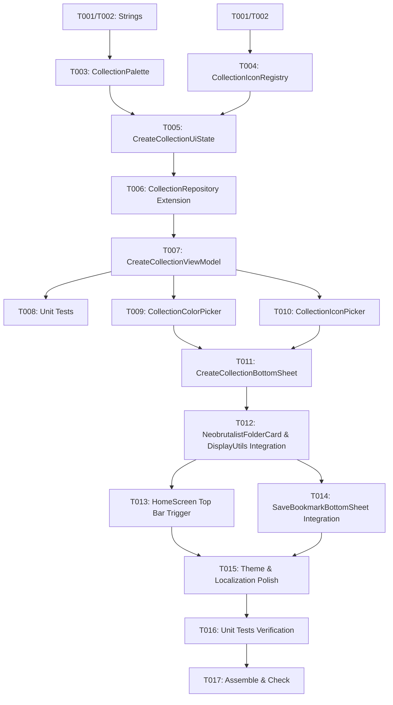

# Tasks: Create New Collection Modal

**Input**: Design documents from `specs/009-create-collection/`
**Prerequisites**: `plan.md`, `spec.md`, `data-model.md`, `contracts/create-collection-contract.md`, `research.md`, `quickstart.md`

## Format: `[ID] [P?] [Story] Description`
- **[P]**: Can run in parallel (different files, no dependencies)
- **[Story]**: Which user story this task belongs to (e.g., US1, US2, US3, US4)
- Includes exact file paths in descriptions

---

## Phase 1: Setup (Localization, Registries & State Model)

**Purpose**: Establish base localization strings, centralized 16-color and 43-icon registries, and presentation state holder models.

- [x] T001 [P] Add English collection creation localization string resources in `app/src/main/res/values/strings.xml`
- [x] T002 [P] Add Portuguese (pt-BR) collection creation localization string resources in `app/src/main/res/values-pt-rBR/strings.xml`
- [x] T003 [P] Create `CollectionPalette` defining the 16 curated Neobrutalism colors in `app/src/main/java/com/madruga665/bookmarks/ui/utils/CollectionPalette.kt`
- [x] T004 [P] Create `CollectionIconRegistry` defining the ~43 curated category vector icons in `app/src/main/java/com/madruga665/bookmarks/ui/utils/CollectionIconRegistry.kt`
- [x] T005 [P] Create `CreateCollectionUiState` presentation model with character count and dynamic submit validation in `app/src/main/java/com/madruga665/bookmarks/ui/collection/create/CreateCollectionUiState.kt`

---

## Phase 2: Foundational (Repository Extension & ViewModel)

**Purpose**: Build the core repository methods and ViewModel to manage collection creation, validation, and reactive state.

- [x] T006 Extend `CollectionRepository.createCollection` to accept `iconKey` and handle color hex strings in `app/src/main/java/com/madruga665/bookmarks/data/repository/CollectionRepository.kt`
- [x] T007 Implement `CreateCollectionViewModel` with Hilt injection, input handling, and collection persistence in `app/src/main/java/com/madruga665/bookmarks/ui/collection/create/CreateCollectionViewModel.kt`
- [x] T008 [P] Create unit test suite for `CreateCollectionViewModel` verifying name validation, color/icon selection, and repository creation in `app/src/test/java/com/madruga665/bookmarks/ui/collection/create/CreateCollectionViewModelTest.kt`

**Checkpoint**: Foundation ready — `CreateCollectionViewModel` tested and operational.

---

## Phase 3: User Story 1 & 2 - Color & Icon Pickers and Modal Scaffolding (Priority: P1) 🎯 MVP

**Goal**: Deliver the "Add new collection" bottom sheet modal featuring real-time color picking (16 swatches) and icon selection (~43 icons).

**Independent Test**: Open the modal, type a collection name, select different colors and icons, verify the selected icon tile highlights with the chosen color, tap "Create collection", and verify the new folder is persisted and visible.

- [x] T009 [P] [US1] Implement `CollectionColorPicker` 16-color palette grid with selection checkmark in `app/src/main/java/com/madruga665/bookmarks/ui/collection/create/components/CollectionColorPicker.kt`
- [x] T010 [P] [US2] Implement `CollectionIconPicker` 8-column icon grid where the selected icon is filled with the currently selected color in `app/src/main/java/com/madruga665/bookmarks/ui/collection/create/components/CollectionIconPicker.kt`
- [x] T011 [US1] Implement `CreateCollectionBottomSheet` modal with drag handle, title, close button, name input with counter, color picker, icon picker, and "Create collection" action button in `app/src/main/java/com/madruga665/bookmarks/ui/collection/create/CreateCollectionBottomSheet.kt`
- [x] T012 [US2] Update `NeobrutalistFolderCard` and `BookmarkDisplayUtils` to resolve icons from `CollectionIconRegistry` and colors from `CollectionPalette` in `app/src/main/java/com/madruga665/bookmarks/ui/components/NeobrutalistFolderCard.kt` and `app/src/main/java/com/madruga665/bookmarks/ui/utils/BookmarkDisplayUtils.kt`

**Checkpoint**: User Stories 1 and 2 deliver the complete MVP matching the reference screenshot.

---

## Phase 4: User Story 3 & 4 - Entry Point Triggers, Save Modal Integration & Polish (Priority: P2 / P3)

**Goal**: Connect the modal to all trigger entry points (Home Screen Top Bar and Bookmark Save Modal) and verify Neobrutalism theming and localization.

**Independent Test**: Tap the folder button in Home Top Bar to open the creation modal; also trigger from "Create New Folder" in the Bookmark Save Modal, verifying new folder is created and auto-selected.

- [x] T013 [US3] Wire Home Screen top bar folder button (`tag_top_bar_manage_collections`) to open `CreateCollectionBottomSheet` in `app/src/main/java/com/madruga665/bookmarks/ui/home/HomeScreen.kt`
- [x] T014 [US3] Integrate `CreateCollectionBottomSheet` into `SaveBookmarkBottomSheet` when tapping "Create New Folder" in `app/src/main/java/com/madruga665/bookmarks/ui/savemodal/SaveBookmarkBottomSheet.kt`
- [x] T015 [P] [US4] Verify and refine Neobrutalism styling across Light and Catppuccin Mocha Dark themes and bilingual string rendering in `app/src/main/java/com/madruga665/bookmarks/ui/collection/create/CreateCollectionBottomSheet.kt`

---

## Phase 5: Polish & Quality Verification

**Purpose**: Execute end-to-end unit tests and build validation.

- [x] T016 Run complete unit test suite (`./gradlew test`) to verify zero regressions across all modules
- [x] T017 Run build and static analysis check (`./gradlew assembleDebug check`)

---

## Dependencies & Execution Order

## Parallel Execution Opportunities

- **Phase 1**: `T001`, `T002`, `T003`, `T004`, `T005` can execute fully in parallel.
- **Phase 2**: `T008` (Unit Tests) can execute concurrently with ViewModel implementation.
- **Phase 3 (US1 & US2)**: `T009` (`CollectionColorPicker`) and `T010` (`CollectionIconPicker`) can be developed in parallel.
- **Phase 4 (US3 & US4)**: `T013` (Home trigger), `T014` (Save modal trigger), and `T015` (Theme polish) can proceed concurrently once modal scaffolding is ready.

