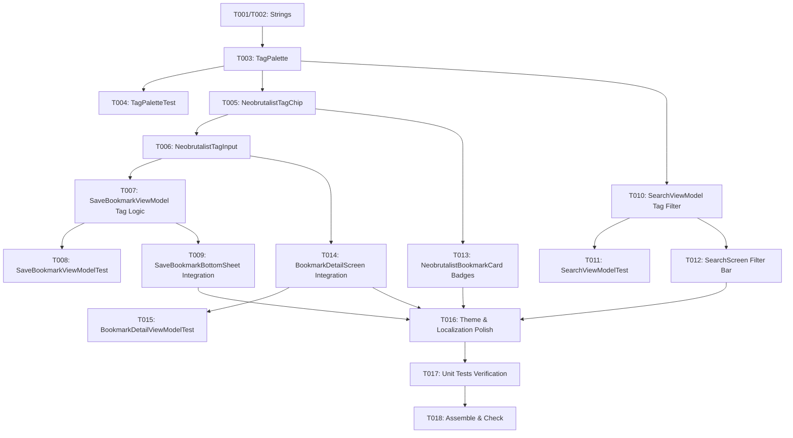

# Tasks: Bookmark Tagging System

**Input**: Design documents from `specs/010-bookmark-tags/`
**Prerequisites**: `plan.md`, `spec.md`, `data-model.md`, `contracts/tag-contracts.md`, `research.md`, `quickstart.md`

## Format: `[ID] [P?] [Story] Description`
- **[P]**: Can run in parallel (different files, no dependencies)
- **[Story]**: Which user story this task belongs to (e.g., US1, US2, US3, US4)
- Includes exact file paths in descriptions

---

## Phase 1: Setup (Localization, Registries & Models)

**Purpose**: Establish base localization strings, centralized 10-color tag palette, and domain extension helpers.

- [x] T001 [P] Add English localization string resources for tags in `app/src/main/res/values/strings.xml`
- [x] T002 [P] Add Portuguese (pt-BR) localization string resources for tags in `app/src/main/res/values-pt-rBR/strings.xml`
- [x] T003 [P] Create `TagPalette` with 10-color Neobrutalism palette, deterministic color hashing, and `BookmarkEntity` tag extension helpers (`tagList`, `toTagString()`) in `app/src/main/java/com/madruga665/bookmarks/ui/utils/TagPalette.kt`
- [x] T004 [P] Create unit tests for `TagPalette` and tag extension helpers in `app/src/test/java/com/madruga665/bookmarks/ui/utils/TagPaletteTest.kt`

---

## Phase 2: Foundational UI Components

**Purpose**: Build reusable Neobrutalism tag chips and interactive tag input components.

- [x] T005 [P] Implement `NeobrutalistTagChip` composable with removable and selectable states in `app/src/main/java/com/madruga665/bookmarks/ui/components/NeobrutalistTagChip.kt`
- [x] T006 [P] Implement `NeobrutalistTagInput` composable supporting chip flow row and Enter/comma/add text entry in `app/src/main/java/com/madruga665/bookmarks/ui/components/NeobrutalistTagInput.kt`

---

## Phase 3: User Story 1 - Add & Remove Tags on Save Modal (Priority: P1) 🎯 MVP

**Goal**: Allow users to assign, type, and remove tags when saving a bookmark.

**Independent Test**: Open the bookmark save modal, type tags (`android`, `compose`), verify chips appear, remove a tag, and confirm save. Verify tags are persisted to Room database.

- [x] T007 [US1] Update `SaveBookmarkModalUiState` and `SaveBookmarkViewModel` to support tags, input handling, and tag persistence in `app/src/main/java/com/madruga665/bookmarks/ui/savemodal/SaveBookmarkViewModel.kt`
- [x] T008 [P] [US1] Update `SaveBookmarkViewModelTest` with unit tests for tag addition, removal, delimiter handling, and validation in `app/src/test/java/com/madruga665/bookmarks/ui/savemodal/SaveBookmarkViewModelTest.kt`
- [x] T009 [US1] Integrate `NeobrutalistTagInput` into `SaveBookmarkBottomSheet` in `app/src/main/java/com/madruga665/bookmarks/ui/savemodal/SaveBookmarkBottomSheet.kt`

---

## Phase 4: User Story 2 - Filter Bookmarks by Tags in Dedicated Search (Priority: P1) 🎯 MVP

**Goal**: Enable filtering search results by tapping tag chips on the Search Screen.

**Independent Test**: Open Search Screen, tap a tag chip, and verify search results immediately filter to show only matching bookmarks in under 100ms.

- [x] T010 [US2] Update `SearchUiState` and `SearchViewModel` to expose `availableTags`, `selectedTags`, and reactive tag filtering in `app/src/main/java/com/madruga665/bookmarks/ui/search/SearchViewModel.kt`
- [x] T011 [P] [US2] Update `SearchViewModelTest` with unit tests for tag filtering and combined text-tag searches in `app/src/test/java/com/madruga665/bookmarks/ui/search/SearchViewModelTest.kt`
- [x] T012 [US2] Update `SearchScreen.kt` to render horizontal scrollable tag chip filter bar and wire tag selection in `app/src/main/java/com/madruga665/bookmarks/ui/search/SearchScreen.kt`

---

## Phase 5: User Story 3 - Visual Tag Badges on Cards & Details Screen (Priority: P2)

**Goal**: Display tag badges on bookmark cards and provide tag management on the Bookmark Detail screen.

**Independent Test**: View collections with tagged bookmarks; verify badges render with high contrast and overflow indicators. Open Bookmark Details and dynamically add/remove tags.

- [x] T013 [US3] Update `NeobrutalistBookmarkCard` to render compact tag badges (`#tag`) and overflow indicator (`+N`) in `app/src/main/java/com/madruga665/bookmarks/ui/components/NeobrutalistBookmarkCard.kt`
- [x] T014 [US3] Update `BookmarkDetailUiState`, `BookmarkDetailViewModel`, and `BookmarkDetailScreen` to display and manage tags dynamically in `app/src/main/java/com/madruga665/bookmarks/ui/bookmark/BookmarkDetailViewModel.kt` and `app/src/main/java/com/madruga665/bookmarks/ui/bookmark/BookmarkDetailScreen.kt`
- [x] T015 [P] [US3] Update `BookmarkDetailViewModelTest` verifying adding/removing tags on detail screen in `app/src/test/java/com/madruga665/bookmarks/ui/bookmark/BookmarkDetailViewModelTest.kt`

---

## Phase 6: Polish & Quality Verification

**Purpose**: Verify theme contrast, bilingual strings, and execute full automated test suite.

- [x] T016 Verify Neobrutalism tokens across Light and Catppuccin Mocha Dark themes and Portuguese/English localization in tag components
- [x] T017 Run complete unit test suite (`./gradlew test`) to verify zero regressions across all modules
- [x] T018 Run build and static analysis check (`./gradlew assembleDebug check`)

---

## Phase 7: Convergence

- [x] T019 [US4] Implement tag autocomplete/suggestion dropdown in `NeobrutalistTagInput` matching existing tags by prefix per FR US4 acceptance scenarios (missing)
- [x] T020 [FR-003] Enforce 10-tag max limit and 25-char input truncation in `BookmarkDetailViewModel.onSaveNewTag()` to match `SaveBookmarkViewModel` validation (partial)
- [x] T021 [FR-010] Evaluate tags at repository/DAO layer for search or document architectural decision for ViewModel-layer filtering per plan intent (partial)
- [x] T022 [contracts] Align `SearchTagFilterRow` clear-button contract with "All" chip implementation or update implementation to match contract spec (partial)
- [x] T023 [Edge Case] Clarify or implement space-to-hyphen tag normalization per spec edge case definition (partial)

---

## Dependencies & Execution Order

## Parallel Execution Opportunities

- **Phase 1**: `T001`, `T002`, `T003`, `T004` can execute in parallel.
- **Phase 2**: `T005` (`NeobrutalistTagChip`) and `T006` (`NeobrutalistTagInput`) can proceed concurrently once models exist.
- **Phase 3 & 4 (US1 & US2)**: Save modal integration (`T007`-`T009`) and Search filter integration (`T010`-`T012`) can execute concurrently.
- **Phase 5 (US3)**: Bookmark card badge rendering (`T013`) and Detail screen tag management (`T014`-`T015`) can proceed in parallel.
