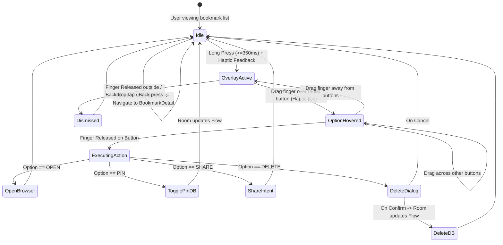

# Data Model: Bookmark Long-Press Actions Menu

**Feature**: `011-bookmark-actions-menu`  
**Date**: 2026-08-18

## 1. Entities & Enums

### BookmarkOption (Enum)

Represents the available contextual actions accessible via the radial long-press menu:

```kotlin
enum class BookmarkOption {
    OPEN,       // Launch URL in external browser / custom tab
    PIN,        // Toggle pinned status (true <-> false)
    SHARE,      // Open native Android Share sheet
    DELETE      // Prompt delete confirmation dialog
}
```

### BookmarkActionItemData (Presentation Model)

Represents a single radial button item with localized labels, icons, and accent colors:

```kotlin
data class BookmarkActionItemData(
    val option: BookmarkOption,
    val label: String,
    val icon: ImageVector,
    val accentColor: Color,
    val isDestructive: Boolean = false
)
```

### BookmarkActionsOverlayState (Transient UI State)

Encapsulates active gesture positioning, highlighted bookmark entity, and hover detection:

```kotlin
data class BookmarkActionsOverlayState(
    val activeBookmark: BookmarkEntity? = null,
    val cardOffset: Offset? = null,
    val cardSize: IntSize? = null,
    val touchPositionInWindow: Offset? = null,
    val hoveredOption: BookmarkOption? = null,
    val bookmarkToDelete: BookmarkEntity? = null
) {
    val isMenuVisible: Boolean
        get() = activeBookmark != null && cardOffset != null && cardSize != null
}
```

---

## 2. Existing Entity Integration (`BookmarkEntity`)

The existing `BookmarkEntity` in Room persistence is used directly:

```kotlin
@Entity(tableName = "bookmarks")
data class BookmarkEntity(
    @PrimaryKey val id: String,
    val url: String,
    val title: String,
    val description: String?,
    val faviconUrl: String?,
    val thumbnailUrl: String?,
    val sourcePlatform: String,
    val collectionId: String,
    val notes: String?,
    val tags: String,
    val isPinned: Boolean,
    val createdAt: Long,
    val updatedAt: Long,
    val syncStatus: String
)
```

---

## 3. State Transitions


