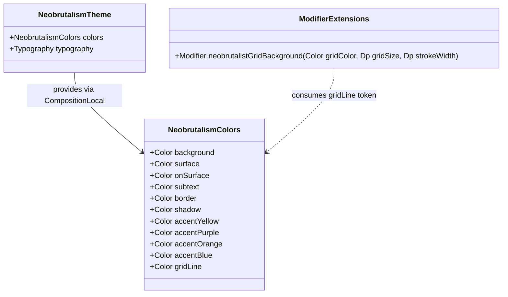

# Data Model & Theme Tokens: Subtle Neobrutalist Grid Background Pattern

**Feature**: `012-grid-background`  
**Date**: 2026-08-22

---

## 1. Theme Data Structures

### `NeobrutalismColors` (UI Theme Model)

Immutable data class encapsulated in `com.madruga665.bookmarks.ui.theme.Color.kt`.

| Property | Type | Description | Light Value | Dark Value (Mocha) |
|---|---|---|---|---|
| `background` | `androidx.compose.ui.graphics.Color` | Primary screen canvas background color | `Color(0xFFF8F8F8)` | `Color(0xFF1E1E2E)` (`MochaBase`) |
| `surface` | `androidx.compose.ui.graphics.Color` | Solid card and container surface fill | `Color(0xFFFFFFFF)` | `Color(0xFF313244)` (`MochaSurface0`) |
| `onSurface` | `androidx.compose.ui.graphics.Color` | Primary text and icon foreground color | `Color(0xFF000000)` | `Color(0xFFCDD6F4)` (`MochaText`) |
| `subtext` | `androidx.compose.ui.graphics.Color` | Secondary text and subtitle color | `Color(0xFF555555)` | `Color(0xFFA6ADC8)` (`MochaSubtext0`) |
| `border` | `androidx.compose.ui.graphics.Color` | High-contrast component outline border | `Color(0xFF000000)` | `Color(0xFF11111B)` (`MochaCrust`) |
| `shadow` | `androidx.compose.ui.graphics.Color` | Hard offset drop shadow color | `Color(0xFF000000)` | `Color(0xFF11111B)` (`MochaCrust`) |
| `accentYellow` | `androidx.compose.ui.graphics.Color` | Primary accent color | `Color(0xFFFFD600)` | `Color(0xFFF9E2AF)` (`MochaYellow`) |
| `accentPurple` | `androidx.compose.ui.graphics.Color` | Secondary accent color | `Color(0xFF7C5CFF)` | `Color(0xFFCBA6F7)` (`MochaMauve`) |
| `accentOrange` | `androidx.compose.ui.graphics.Color` | Tertiary accent color | `Color(0xFFFF6B00)` | `Color(0xFFFAB387)` (`MochaPeach`) |
| `accentBlue` | `androidx.compose.ui.graphics.Color` | Quaternary accent color | `Color(0xFF3399FF)` | `Color(0xFF89B4FA)` (`MochaBlue`) |
| `gridLine` | `androidx.compose.ui.graphics.Color` | **New**: Discreet repeating grid pattern stroke color | `Color(0xFFE2E2E2)` | `Color(0xFF28283D)` |

---

## 2. Component Design Tokens

### `GridBackgroundDefaults` (Theme Configuration)

Constants for grid sizing and stroke dimensions.

```kotlin
object GridBackgroundDefaults {
    val GridSize = 24.dp
    val StrokeWidth = 1.dp
}
```

- **Grid Size**: `24.dp` x `24.dp` square grid cells.
- **Stroke Width**: `1.dp` fine hairline vector stroke.
- **Alignment / Origin**: Anchored to `(0, 0)` of the root viewport container.

---

## 3. Entity Relationships


