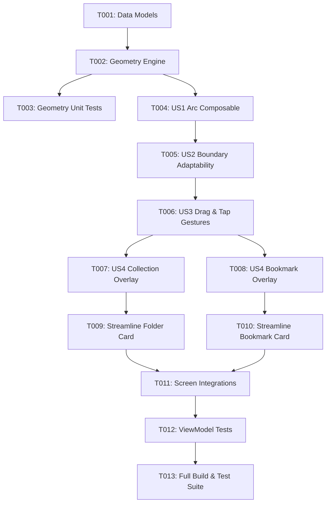

# Tasks: Touch-Anchored Arc Actions Menu

**Input**: Design documents from `/specs/013-arc-action-menu/`
**Prerequisites**: [plan.md](./plan.md), [spec.md](./spec.md), [research.md](./research.md), [data-model.md](./data-model.md), [contracts/arc-menu-contract.md](./contracts/arc-menu-contract.md)

## Format: `[ID] [P?] [Story] Description`

- **[P]**: Can run in parallel (different files, no dependencies)
- **[Story]**: Which user story this task belongs to (e.g., US1, US2, US3, US4)

---

## Phase 1: Setup (Shared Infrastructure)

**Purpose**: Define the core data contracts and geometric models for the Arc Menu.

- [X] T001 Create data models and position data classes in `app/src/main/java/com/madruga665/bookmarks/ui/components/ArcActionItem.kt`

---

## Phase 2: Foundational (Blocking Prerequisites)

**Purpose**: Implement and verify the mathematical calculation engine for radial geometry, boundary clipping prevention, and hit-testing.

**⚠️ CRITICAL**: Must complete before composable integration.

- [X] T002 [P] Implement pure Kotlin geometry and hit-testing engine in `app/src/main/java/com/madruga665/bookmarks/ui/components/ArcGeometryCalculator.kt`
- [X] T003 [P] Create comprehensive unit tests for arc trigonometry, adaptive sectors, and hit-testing in `app/src/test/java/com/madruga665/bookmarks/ui/components/ArcGeometryCalculatorTest.kt`

**Checkpoint**: Core mathematical foundation tested and verified.

---

## Phase 3: User Story 1 - Dynamic Touch-Anchored Arc Menu Deployment (Priority: P1) 🎯 MVP

**Goal**: Deploy satellite action buttons in a radial arc anchored directly at the user's touch coordinate with smooth spring blossom animation and persistent Neobrutalist text badges.

**Independent Test**: Long-press any card and verify satellite buttons blossom outward from the exact finger contact location with crisp Neobrutalist borders, shadows, and labels.

### Implementation for User Story 1

- [X] T004 [US1] Implement `NeobrutalistArcActionsMenu` composable with spring blossom animations, radial positioning, and persistent text badges in `app/src/main/java/com/madruga665/bookmarks/ui/components/NeobrutalistArcActionsMenu.kt`

**Checkpoint**: Satellite arc menu renders and animates outwards from touch coordinate.

---

## Phase 4: User Story 2 - Boundary-Aware Arc Angle & Orientation Calculation (Priority: P1) 🎯 MVP

**Goal**: Ensure all satellite buttons and text badges remain 100% visible on screen when touch occurs near edges or corners.

**Independent Test**: Trigger long-press near screen edges (right, left, bottom, top) and verify the arc automatically projects inward without clipping.

### Implementation for User Story 2

- [X] T005 [US2] Integrate screen viewport boundaries and adaptive quadrant/edge sector calculation into `NeobrutalistArcActionsMenu.kt` using `ArcGeometryCalculator`

**Checkpoint**: Arc menu adapts dynamically across all screen edges and corner touch coordinates.

---

## Phase 5: User Story 3 - Dual Continuous Drag-to-Select & Tap-to-Select Interaction (Priority: P1) 🎯 MVP

**Goal**: Support fluid drag-and-release selection with real-time hover highlight and haptics, as well as discrete tap selection.

**Independent Test**: Test (1) dragging finger over an action and releasing to execute, and (2) lifting finger and tapping an action directly.

### Implementation for User Story 3

- [X] T006 [US3] Implement pointer drag hit-testing, hover scale/color animation, haptic feedback, and tap/release event handling in `app/src/main/java/com/madruga665/bookmarks/ui/components/NeobrutalistArcActionsMenu.kt`

**Checkpoint**: Both drag-to-select and tap-to-select interaction flows are fully functional.

---

## Phase 6: User Story 4 - Unified Arc Actions for Collections & Bookmarks (Priority: P2)

**Goal**: Integrate the touch-anchored arc menu across Collection cards (Edit, Share, Delete) and Bookmark cards (Open, Pin/Unpin, Share, Delete) on Home, Collection Detail, and Search screens.

**Independent Test**: Long-press Collection cards on `HomeScreen` and Bookmark cards on `CollectionDetailScreen` and `SearchScreen` and verify all actions trigger their respective flows.

### Implementation for User Story 4

- [X] T007 [P] [US4] Refactor `CollectionActionsOverlay.kt` to use `NeobrutalistArcActionsMenu` with Edit, Share, and Delete actions in `app/src/main/java/com/madruga665/bookmarks/ui/components/CollectionActionsOverlay.kt`
- [X] T008 [P] [US4] Refactor `BookmarkActionsOverlay.kt` to use `NeobrutalistArcActionsMenu` with Open, Pin/Unpin, Share, and Delete actions in `app/src/main/java/com/madruga665/bookmarks/ui/components/BookmarkActionsOverlay.kt`
- [X] T009 [P] [US4] Streamline `NeobrutalistFolderCard.kt` by removing legacy inline floating action buttons in `app/src/main/java/com/madruga665/bookmarks/ui/components/NeobrutalistFolderCard.kt`
- [X] T010 [P] [US4] Streamline `NeobrutalistBookmarkCard.kt` by removing legacy inline action buttons in `app/src/main/java/com/madruga665/bookmarks/ui/components/NeobrutalistBookmarkCard.kt`
- [X] T011 [US4] Verify and update screen integrations and gesture dispatchers in `HomeScreen.kt`, `CollectionDetailScreen.kt`, and `SearchScreen.kt`

**Checkpoint**: Arc actions menu is universally operational across Collections and Bookmarks.

---

## Phase 7: Polish & Cross-Cutting Concerns

**Purpose**: Ensure zero regressions and validate full build and test suites.

- [X] T012 [P] Update existing ViewModel test suites (`CollectionDetailViewModelTest.kt`, `SearchViewModelTest.kt`, `HomeViewModelTest.kt`) to verify updated overlay interactions
- [X] T013 Execute full unit test suite via `./gradlew testDebugUnitTest` to guarantee 100% build and test pass rate

---

## Dependencies & Execution Order

## Parallel Opportunities

- **Phase 2**: T002 and T003 can be developed in parallel with T001.
- **Phase 6**: T007, T008, T009, and T010 can be executed in parallel once T006 is complete.
- **Phase 7**: T012 can run in parallel with final verification steps before T013.

## Implementation Strategy & MVP Scope

1. **MVP Scope**: Phases 1 through 5 (T001 - T006) provide the complete, standalone `NeobrutalistArcActionsMenu` with spring blossoming, boundary calculations, and dual-gesture handling.
2. **Incremental Rollout**: Phase 6 connects the new component to Collections and Bookmarks across `HomeScreen`, `CollectionDetailScreen`, and `SearchScreen`.
3. **Verification**: Phase 7 ensures complete unit test coverage with `./gradlew testDebugUnitTest`.
